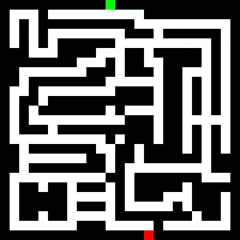
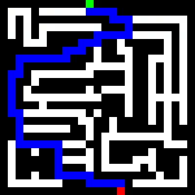
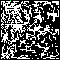
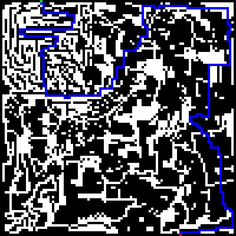

# maze-image-solver-using-Dijkstras-Algorithm 

## Overview
This uses Dijkstra's Algorithm and OpenCV to solve 2D maze images and find the shortest path through each maze image.
The maze image must consiste of a map made of black walls and white paths, with a green pixel indicating the start
position and a red pixel indicating the end position. The solver will generate an image of the maze with a line traced
following the shortest path.

## Examples

 

 

## Manual install
Necessary Packages:
python-opencv
numpy
matplotlib

Install packages using pip install

Instructions for how to run:
From inside the same directory Solver.py is in, use the following to run:

usage: Solver.py [-h] [--method {TDDP,BUDP,Recursive,Benchmark,Difficulty}] [--maze_file MAZE_FILE]

optional arguments:
-h, --help show this help message and exit
--method {TDDP,BUDP,Recursive,Benchmark,Difficulty}
        which form of algorithm to run, TDDP, BUDP, or Recursive. Pass Benchmark to run benchmark test, or Difficulty to test difficulty
--maze_file MAZE_FILE
        the file of the maze (where <input_maze_image_name> is any of the files in the assets folder)

ex:

$ python Solver.py --method TDDP --maze_file maze_25x25_hard.png
$ python Solver.py --method Benchmark
